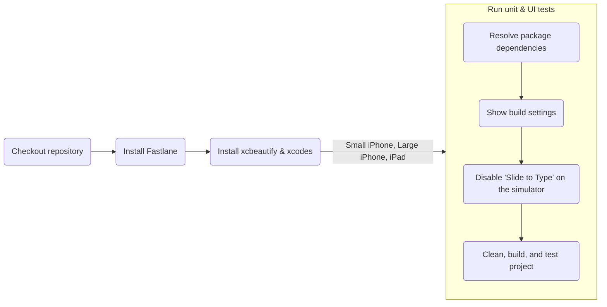
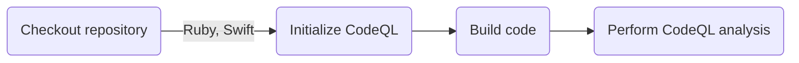
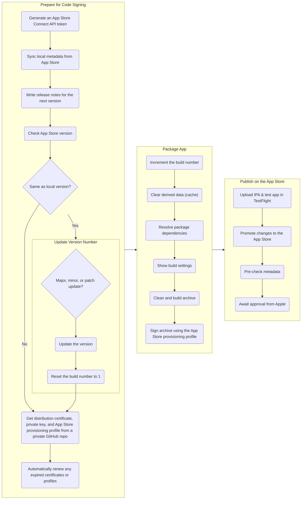

# EZ Recipes iOS App

[](https://github.com/Abhiek187/ez-recipes-ios/actions/workflows/fastlane.yml)
[](https://github.com/Abhiek187/ez-recipes-ios/actions/workflows/codeql.yml)

<div>
  
  
  
  
  
  
  
</div>

## Overview

Cooking food at home is an essential skill for anyone looking to save money and eat healthily. However, learning how to cook can be daunting, since there are so many recipes to choose from. Even when meal prepping, knowing what ingredients to buy, what equipment is required, and the order of steps to make the meal can be hard to remember for many different recipes. Plus, during busy days, it's nice to be able to cook up something quick and tasty.

Introducing EZ Recipes, an app that lets chefs find low-effort recipes that can be made in under an hour, use common kitchen ingredients, and can produce multiple servings. On one page, chefs can view what the recipe looks like, its nutritional qualities, the total cooking time, all the ingredients needed, and step-by-step instructions showing what ingredients and equipment are required per step. Each recipe can be shared so other chefs can learn how to make the same recipes.

Chefs can either find a random recipe or search for one using various filters, including by name, dietary restrictions, spice level, and meal type.

The app features a glossary to easily lookup the meaning of common terms found in recipes. This will better assist newer chefs in learning how to cook, prep certain ingredients, and use certain kitchen tools. Think How to Stock, but for cooking food instead of managing finances.

## Features

- iOS app created using SwiftUI and MVVM architecture
- Responsive and accessible mobile design
- REST APIs to a custom [server](https://github.com/Abhiek187/ez-recipes-server) using Alamofire, which fetches recipe information from [spoonacular](https://spoonacular.com/food-api) and MongoDB
- Offline data storage using UserDefaults and Core Data
- Universal Links to open recipes from the web app to the mobile app
- Automated testing and deployment using CI/CD pipelines in GitHub Actions and Fastlane
- Mermaid to write diagrams as code

## Pipeline Diagrams

### Fastlane CI



### CodeQL



### Deployment



## Installing Locally

A Mac and Xcode are required to run iOS apps locally.

1. [Clone](https://github.com/Abhiek187/ez-recipes-ios.git) this repo.
2. Open `EZ Recipes/EZ Recipes.xcodeproj` in Xcode.
3. Go to File --> Packages --> Resolve Package Versions to fetch all the Swift Package Manager dependencies.
4. Run the **EZ Recipes** scheme.

The recipes will be fetched from the EZ Recipes server hosted on https://ez-recipes-server.onrender.com. To connect to the server locally, follow the directions in the [EZ Recipes server repo](https://github.com/Abhiek187/ez-recipes-server#installing-locally) and change `serverBaseUrl` under `Constants.swift` to `http://localhost:5000`.

### Testing

Unit and UI tests can be run directly from Xcode or through the command line using Fastlane. Follow the [docs](https://docs.fastlane.tools/getting-started/ios/setup/) to setup Fastlane on iOS. In addition, run the following to install all dependencies locally:

```bash
cd EZ\ Recipes
bundle config set --local path 'vendor/bundle'
bundle install
brew install xcbeautify
```

Then run the following command to run each test, where `DEVICE` is the name of an iOS device (surround with quotes to include spaces):

```bash
bundle exec fastlane ios test device:DEVICE
```

Valid device names can be found by running `xcrun xctrace list devices`.

### Screenshots

Screenshots can be generated automatically using Fastlane. In addition to the Fastlane installation steps above, ImageMagick is required to add the device frames:

```bash
brew install libpng jpeg imagemagick
```

Then run the following command to generate screenshots at `ez-recipes-ios/EZ Recipes/fastlane/screenshots` (ignored by git):

```bash
bundle exec fastlane ios screenshots
```

To download the latest `SnapshotHelper.swift`, run:

```bash
bundle exec fastlane snapshot update
```

To download the latest frames, run:

```bash
bundle exec fastlane frameit download_frames
```

### Deployment

Follow the steps on [Fastlane's docs](https://docs.fastlane.tools/app-store-connect-api/) to generate an App Store Connect API key. Then follow these steps to create a new release for select testers in TestFlight:

1. Make sure the `fastlane/metadata` directory is up-to-date by running `bundle exec fastlane deliver`
2. Write the release notes for the next version code in `fastlane/changelogs`, where the filename is `VERSION.txt`.
3. Run `bundle exec fastlane ios beta` to create an IPA and upload it to TestFlight. When first uploading a new update, select whether this is a major, minor, or patch update to update the version and reset the build number to 1. On subsequent uploads to the same version, the build number will be incremented.

Once the TestFlight build is tested and ready for production, run `bundle exec fastlane ios release` to promote the TestFlight build to production. Send the changes for approval on App Store Connect and wait for Apple to approve the app (usually within 24-48 hours).

## Future Updates

Check the [EZ Recipes web repo](https://github.com/Abhiek187/ez-recipes-web#future-updates) for a list of future updates.

## Related Repos

- [Web app](https://github.com/Abhiek187/ez-recipes-web)
- [Android app](https://github.com/Abhiek187/ez-recipes-android)
- [Server](https://github.com/Abhiek187/ez-recipes-server)
