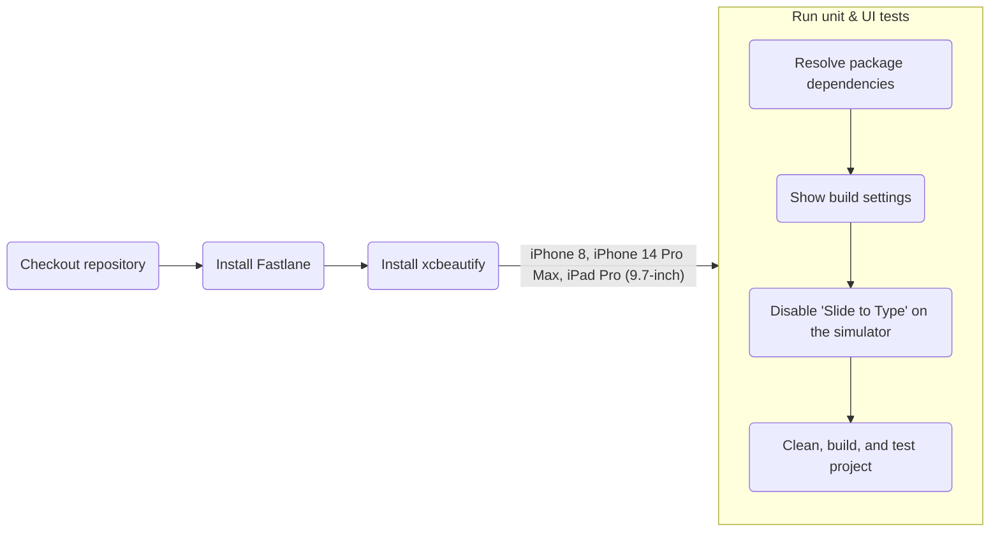

# EZ Recipes iOS App

[](https://github.com/Abhiek187/ez-recipes-ios/actions/workflows/fastlane.yml)

## Overview

Cooking food at home is an essential skill for anyone looking to save money and eat healthily. However, learning how to cook can be daunting, since there are so many recipes to choose from. And even when meal prepping, knowing what ingredients to buy, what equipment is required, and the order of steps to make the meal can be hard to remember for many different recipes. Plus, during busy days, it's nice to be able to cook up something quick and tasty.

Introducing EZ Recipes, an app that lets chefs find low-effort recipes that can be made in under an hour, use common kitchen ingredients, and can produce multiple servings. On one page, chefs can view what the recipe looks like, its nutritional qualities, the total cooking time, all the ingredients needed, and step-by-step instructions showing what ingredients and equipment are required per step. Each recipe can be shared so other chefs can learn how to make the same recipes.

## Features

- iOS app created using SwiftUI and MVVM architecture
- Responsive and accessible mobile design
- REST APIs to a custom [server](https://github.com/Abhiek187/ez-recipes-server) using Alamofire, which fetches recipe information from [spoonacular](https://spoonacular.com/food-api)
- Automated testing and deployment using CI/CD pipelines in GitHub Actions and Fastlane

## Pipeline Diagrams

### Fastlane CI



## Installing Locally

A Mac and Xcode are required to run iOS apps locally.

1. [Clone](https://github.com/Abhiek187/ez-recipes-ios.git) this repo.
2. Open `EZ Recipes/EZ Recipes.xcodeproj` in Xcode.
3. Go to File --> Packages --> Resolve Package Versions to fetch all the Swift Package Manager dependencies.
4. Run the **EZ Recipes** scheme.

The recipes will be fetched from the EZ Recipes server hosted on https://ez-recipes-server.onrender.com/api/recipes. To connect to the server locally, follow the directions in the [EZ Recipes server repo](https://github.com/Abhiek187/ez-recipes-server#installing-locally) and change `recipeBaseUrl` under `Constants.swift` to `http://localhost:5000/api/recipes`.

### Testing

Unit and UI tests can be run directly from Xcode or through the command line using Fastlane. Follow the [docs](https://docs.fastlane.tools/getting-started/ios/setup/) to setup Fastlane on iOS. Then run the following, where `DEVICE` is the name of an iOS device (surround with quotes to include spaces):

```bash
cd EZ\ Recipes
bundle config set --local path 'vendor/bundle'
bundle install
brew install xcbeautify
bundle exec fastlane ios test device:DEVICE
```

Valid device names can be found by running `xcrun xctrace list devices`.

## Future Updates

Check the [EZ Recipes web repo](https://github.com/Abhiek187/ez-recipes-web#future-updates) for a list of future updates.
